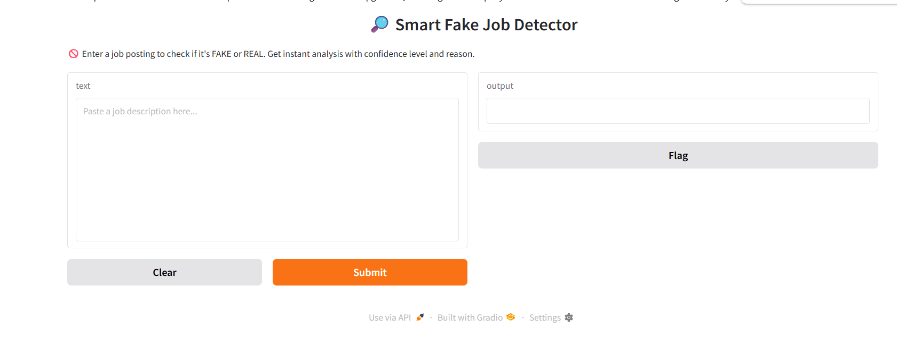
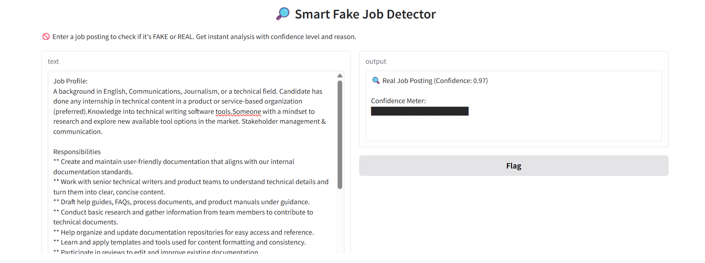
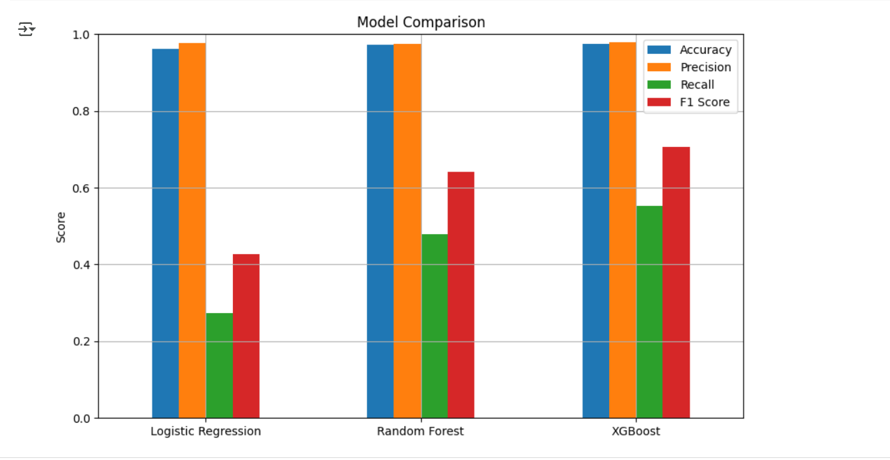

# 🧠 Smart Job Detector – Fake Job Posting Detection using Machine Learning






=======================

## 📌 Project Overview


In today’s digital job market, fake job postings have become a widespread scam targeting students, freshers, and professionals. Our project, \*\*Smart Job Detector\*\*, is an AI-powered tool that uses machine learning and NLP to detect fraudulent job listings automatically.


Built in Python using \*\*Google Colab\*\*, this model analyzes job details and flags suspicious postings in real time—helping protect job seekers from data theft and financial loss.


----------------------------------------------------------------------------------------

## 🧪 Features


- 🔍 Detects whether a job posting is real or fake
- 🤖 Trained on 70,000+ job listings from Kaggle
- 📊 Visualizations for fraud pattern insights
- 📈 Achieved 97.5% accuracy using Random Forest
- 💬 Converts raw text to meaningful features using TF-IDF
- 📦 Easy integration potential for job portals or HR tools


----------------------------------------------------------------------------------------------

## 📁 Dataset


- **Source:** [Fake Job Postings – Kaggle](https://www.kaggle.com/shivamb/real-or-fake-fake-jobposting-prediction)
- **Fields Used:**
  - Job title
  - Company profile
  - Description
  - Requirements
  - Fraudulent flag (target)


-------------------------------------------------------------------

## ⚙️ Tech Stack

- **Language:** Python  
- **Platform:** Google Colab  
- **Libraries:** 
  - `pandas`, `numpy`
  - `scikit-learn`
  - `matplotlib`, `seaborn`
  - `nltk`, `re`
  - `TF-IDF Vectorizer`
--------------------------------------------------------------------

## 🧠 Machine Learning Models


| Model               | Accuracy |
|--------------------|----------|
| Logistic Regression| 94%      |
| SVM                | 96%      |
| **Random Forest**  | **97.5%** ✅ |
| XGBoost            | 96.3%    |


-------------------------------------------------------------------


## 📉 Visual Output

Below are key visual outputs from our project:

### 📌 Smart Job Detector - Model Accuracy Graph




-------------------------------------------------------------------------------

## 🚀 Future Enhancements

- Add **BERT/RoBERTa** for contextual deep learning
- Deploy as **browser extension** or **REST API**
- Support **regional languages** like Hindi, Tamil, etc.
- Build a **mobile app** for quick on-the-go fraud checks
- Add **feedback loop** to make the model smarter with time
-------------------------------------------------------------------------------

## 📂 How to Use


1. Clone the repo:

```bash
git clone https://github.com/YOUR\_USERNAME/smart-job-detector.git

2. Install dependencies:

pip install -r requirements.txt


3. Open the notebook in Google Colab or Jupyter:

Fake_Job_Posting_Detection.ipynb


4. Run all cells and test the model.

----------------------------------------------------------------------------------------

🙋‍♀️ *Made with 💙 by:*

**Ishant Kashyap**

**Arnav Sharma**

**Binita Sharma**

**Kasturi Singh Chauhan**

**Harsh Chana**


